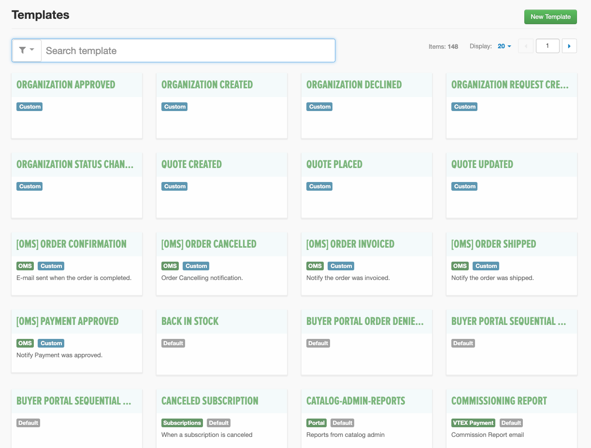

# VTEX Email Framework

This framework provides a streamlined process for developing and managing transactional email templates for VTEX e-commerces, based on the robust [Bojler](https://github.com/Slicejack/bojler) email framework.

## Table of Contents

-   [Key Features](#key-features)
-   [Getting Started](#getting-started)
    -   [Prerequisites](#prerequisites)
    -   [Installation](#installation)
    -   [Development Server](#development-server)
-   [Available Scripts](#available-scripts)
-   [File Structure](#file-structure)
-   [Customization](#customization)
    -   [Email Templates (`source/templates/`)](#email-templates-sourcetemplates)
    -   [Styling (`source/sass/`)](#styling-sourcesass)
    -   [Data (`source/data/`)](#data-sourcedata)
    -   [Internationalization (`source/locales/`)](#internationalization-sourcelocales)
    -   [Custom Handlebars Helpers (`source/helpers/`)](#custom-handlebars-helpers-sourcehelpers)
-   [VTEX Email Subjects](#vtex-email-subjects)
-   [Creating and Editing Transactional Email Templates](#creating-and-editing-transactional-email-templates)
    -   [Editing a Transactional Email Template](#editing-a-transactional-email-template)
    -   [Creating a Transactional Email Template](#creating-a-transactional-email-template)


## Key Features

- **SASS Support**: Write modular and reusable CSS.
- **Automatic CSS Inlining**: Ensures maximum compatibility with email clients.
- **Embedded CSS & Live Reload**: Speeds up development with a built-in webserver and real-time updates.
- **Handlebars & Tachyons**: Simplifies template creation and styling with powerful tools.
- **i18n for Internationalization**: Easily manage multiple languages.
- **VTEX-Ready**: Includes sample JSON data for realistic previews.

## Getting Started

To get started with the VTEX Email Framework, follow these steps:

### Prerequisites

Before you begin, ensure you have the following installed:

- [Node.js](https://nodejs.org/) (v16.x or higher recommended)
- [Yarn](https://yarnpkg.com/) (or npm)

### Installation

1.  **Clone the repository**:

    ```bash
    git clone https://github.com/kadu-m/vtex-emails.git
    cd vtex-emails
    ```

2.  **Install dependencies**:

    ```bash
    yarn install
    # or npm install
    ```

### Development Server

To start the development server with live reload:

```bash
yarn dev
# or npm run dev
```

Your browser will automatically open at `http://localhost:8000`, where you can preview your email templates with real-time updates as you make changes.

## Available Scripts

Here are the commands you can use with this framework:

| Command                  | Description                                                                                                                                                                                                                         |
| :----------------------- | :------------------------------------------------------------------------------------------------------------------------------------------------------------------------------------------------------------------------------------ |
| `yarn dev` (or `npm run dev`) | Starts a local development server with live reloading. This is used for previewing and developing email templates in real-time. Your browser will open to `http://localhost:8000`.                                                              |
| `yarn dist` (or `npm run dist`) | Builds the final, production-ready email templates. This command compiles all Handlebars templates, inlines CSS, and outputs the optimized HTML files into the `dist` folder. These are the files you would typically upload to VTEX. |


## File Structure

This project follows a clear and organized file structure to facilitate development and maintenance:

```
/vtex-emails
|-- /dist
|-- /node_modules
|-- /public
|-- /source
|   |-- /data
|   |-- /helpers
|   |-- /locales
|   |-- /sass
|   |-- /templates
|-- .eslintrc
|-- .gitignore
|-- gulpfile.js
|-- package.json
|-- README.md
|-- yarn.lock
```

-   **`dist/`**: This directory contains the final, compiled HTML email templates. These files are optimized for production, with CSS inlined and ready to be uploaded to the VTEX Message Center.
-   **`node_modules/`**: Standard directory for Node.js dependencies installed via `yarn` or `npm`.
-   **`public/`**: A lightweight version of the compiled templates used for local testing and previews during development. It mirrors the structure of `dist` but might not include all production optimizations.
-   **`source/`**: This is the main working directory where all your development efforts will be focused. It contains the raw assets and source code for your email templates.
    -   **`source/data/`**: Contains sample JSON files (e.g., `01-confirmed.json`, `02-cancelled.json`). These files mimic the data structure provided by VTEX for different order statuses and are used to populate the Handlebars templates during development and preview.
    -   **`source/helpers/`**: Houses custom Handlebars helper functions (e.g., `helpers.js`). These helpers extend Handlebars' capabilities, allowing for more complex logic and data manipulation within your email templates.
    -   **`source/locales/`**: Stores JSON files for internationalization (i18n), organized by locale (e.g., `en-US/i18n.json`, `es-AR/i18n.json`). This allows you to manage and switch between different languages for your email content.
    -   **`source/sass/`**: Contains all the Sass (`.scss`) files for styling your email templates. It's organized into partials (e.g., `_variables.scss`, `components/`, `generic/`) to promote modularity and reusability. The `inlined.scss` and `embedded.scss` are crucial for how CSS is processed for email clients.
    -   **`source/templates/`**: This directory holds the Handlebars (`.hbs`) source files for your email templates (e.g., `01-confirmed.hbs`, `partials/`). Each `.hbs` file represents a distinct email template or a reusable partial component.
-   **`.eslintrc`**: Configuration file for ESLint, used for linting JavaScript code.
-   **`.gitignore`**: Specifies intentionally untracked files that Git should ignore.
-   **`gulpfile.js`**: The Gulp.js build script that automates tasks like compiling Sass, inlining CSS, compiling Handlebars templates, and setting up the development server.
-   **`package.json`**: Defines project metadata and lists the project's dependencies and scripts.
-   **`README.md`**: This documentation file.
-   **`yarn.lock`**: Records the exact versions of dependencies used in the project, ensuring consistent installations across different environments.

## Customization

This framework is designed for easy customization to fit your brand's needs. Here's how you can modify different aspects:

### Email Templates (`source/templates/`)

-   **Editing Existing Templates**: Modify the `.hbs` files directly to change the layout and content of your emails. These are Handlebars templates, so you can use Handlebars syntax, including helpers and partials.
-   **Creating New Templates**: To add a new email template, create a new `.hbs` file in the `source/templates/` directory. Ensure you also create a corresponding JSON data file in `source/data/` for previewing.
-   **Partials**: Reusable components like headers, footers, or product lists can be found and modified in `source/templates/partials/`.

### Styling (`source/sass/`)

-   **Sass Files**: All styling is managed through Sass (`.scss`) files. You can modify existing files or add new ones in `source/sass/`.
-   **Variables**: Global styles and variables are typically defined in `source/sass/_variables.scss`.
-   **Inlined vs. Embedded CSS**: The `gulpfile.js` handles the inlining of CSS for email clients. Styles defined in `inlined.scss` are inlined directly into the HTML, while `embedded.scss` styles are placed in a `<style>` block in the `<head>` (though inlining is generally preferred for broader email client compatibility).

### Data (`source/data/`)

-   **Sample Data**: The `source/data/` directory contains JSON files that simulate the data VTEX sends to your email templates. You can modify these files to test different scenarios (e.g., different products, order statuses, customer information).
-   **Adding New Data**: If you create a new template, you should also create a corresponding JSON file in this directory to provide sample data for it.

### Internationalization (`source/locales/`)

-   **Language Files**: Manage multi-language support by editing the `i18n.json` files within the `source/locales/` subdirectories (e.g., `en-US/i18n.json`, `es-AR/i18n.json`).
-   **Usage in Templates**: The `i18n` helper is used in Handlebars templates to pull in translated strings based on the selected locale.

### Custom Handlebars Helpers (`source/helpers/`)

-   **Extending Functionality**: If you need custom logic within your templates that Handlebars doesn't provide out-of-the-box, you can add custom helper functions to `source/helpers/helpers.js`.


# VTEX Email Subjects

This document outlines the email subjects used for transactional emails in the VTEX Email Framework. Each subject is crafted to be clear, concise, and customer-friendly, utilizing dynamic variables for personalization.

## Email Subjects

| Email Template             | Subject Line                                                                 | Purpose                                                                 |
|------------------------|------------------------------------------------------------------------------|-------------------------------------------------------------------------|
| **vtexcommerce-new-order** | `Tu pedido de {{subjectItemAttachment.item}} {{#if subjectItemAttachment.extraItems}} y {{subjectItemAttachment.extraItems}} artículo(s) más {{/if}} fue exitoso!` | Notifies the customer that their order was successfully placed.          |
| **vtexcommerce-order-cancelled** | `Cancelación de tu pedido #{{orderId}}`                                      | Informs the customer that their specific order has been cancelled, including the order ID. |
| **vtexcommerce-order-invoiced**     | `¡Tu pedido de {{subjectItemAttachment.item}} {{#if subjectItemAttachment.extraItems}} y {{subjectItemAttachment.extraItems}} artículo(s) más {{/if}} ha sido facturado!` | Confirms that the order has been invoiced, detailing the primary item and additional items. |
| **vtexcommerce-payment-approved**   | `¡El pago de tu pedido de {{subjectItemAttachment.item}} {{#if subjectItemAttachment.extraItems}} y {{subjectItemAttachment.extraItems}} artículo(s) más {{/if}} ha sido aprobado!` | Notifies the customer that their payment for the order has been approved. |
| **vtexcommerce-order-shipped**      | `¡Tu pedido ha sido enviado! - #{{sequence}}`                                 | Alerts the customer that their order has shipped, including the sequence number for tracking. |

## Abandoned Cart Email

The abandoned cart email requires the installation and configuration of the VTEX Abandoned Cart Service app.

For more information, please refer to the following documentation:

-   [Setting up Abandoned Carts](https://help.vtex.com/tutorial/setting-up-abandoned-carts--tutorials_740)
-   [VTEX Abandoned Cart Service App](https://developers.vtex.com/docs/apps/vtex.abandoned-cart-service)

# Creating and Editing Transactional Email Templates

This guide explains how to create and edit transactional email templates in the Admin interface.

## Editing a Transactional Email Template

To modify an existing transactional email template, follow these steps:

1. **Navigate to Templates**:
   - In the Admin side menu, go to **Message Center** and select **Templates**.
   - Search for the desired template and click its card.

   

2. **Edit Template Details**:
   - Update the **E-mail Title** and **Recipient** fields. Use double braces (e.g., `{{variable}}`) for variables, which will be covered in the next article.

   

3. **Modify HTML Code**:
   - Edit the template's HTML code directly in the **HTML** field or copy it to an external editor, make changes, and paste it back.
   - Use **inline CSS** for styling, as email clients do not support CSS in the `<head>` section.
   - Preview the rendered output in the box below the HTML field. Test responsiveness by selecting different screen sizes (small, medium, large).

   

4. **Review JSON Data**:
   - The **JSON Data** field displays a sample JSON object with email subject information. Use its variables (in braces) within the HTML code for dynamic content.

5. **Save Changes**:
   - Click the **Save** button to apply your changes.

   **Warning**: Always use inline CSS for email layout customization to ensure compatibility with email clients.

## Creating a Transactional Email Template

Creating a new transactional email template follows a similar process:

1. **Access the Template Creation Page**:
   - In the Admin side menu, go to **Message Center** and click **Templates**.
   - Click the **New template** button.

2. **Configure Template Settings**:
   - Check the **Enable e-mail sending** box to activate the template.
   - Enter the **E-mail Title**, **Sender**, and **Recipient ("To")** details.

3. **Add HTML Code**:
   - Input the template's HTML code in the **HTML** field.
   - Test the template using the preview feature to ensure it renders correctly across different screen sizes.

4. **Save the Template**:
   - Click the **Save** button to create the template.
